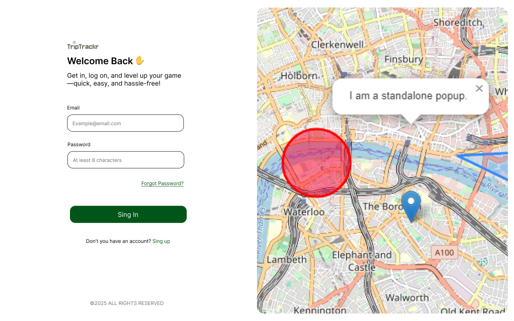

# TripTrackr 🗺️

## Description

**TripTrackr** is an app designed to help travelers efficiently plan their adventures using an interactive map. Users can create personalized itineraries, organize routes, and explore new locations with ease. All in a simple and hassle-free experience!

## Features ✨

- 📍 **Interactive maps**: Plan your trips directly on a map.
- ✏️ **Create and edit itineraries**: Add, remove, or adjust locations as needed.
- 🌍 **Explore new locations**: Search and discover new destinations.
- 🗓️ **Organize by days**: Divide your travel plans by day or stage.
- 💾 **Save and share your trips**: Save your routes and share itineraries with friends and fellow travelers.

## Screenshots 📸



## Installation 🚀

To run the app locally, follow these steps:

1. Clone this repository:
   ```bash
   git clone https://github.com/your-username/triptrackr-app.git
   ```
2. Navigate to the project directory:
   ```bash
   cd triptrackr-app
   ```
3. Install the required dependencies:
   ```bash
   npm install
   ```
4. Start the application:
   ```bash
   npm run start:dev
   ```
5. Open your browser at http://localhost:5173 to see the app in action.

## Environment Setup ⚙️

To configure environment variables for different environments, follow these steps:

1. Inside the `environments` directory, create the following `.env` files:

- `.env.dev` for the development environment.
- `.env.pro` for the production environment.

2. Use the `.env.template` file as a reference for the necessary environment variables. Copy the template structure into your `.env.dev` and `.env.pro` files and customize them as needed.

3. Example:
   ```bash
   # .env.dev
   VITE_APP_PUBLIC_URL=http://localhost:5173/
   VITE_APP_URL=http://localhost:5173/
   VITE_APP_BASE_URL=/
   VITE_APP_API_URL=http://localhost:3001/
   VITE_APP_API_SOCKET_URL=http://localhost:3002/
   ```

Make sure not to commit the .env files to version control for security reasons.

## Technologies Used 🛠️

- React: For the user interface.
- TypeScript: To ensure robust, strongly-typed code.
- Leaflet: For interactive maps.
- Nestjs: For the backend.
- MongoDB: To store user itineraries.

## How to Contribute 🤝

1. Fork the repository.
2. Create a new branch:
   ```bash
   git checkout -b feature/new-feature
   ```
3. Make your changes and commit:
   ```bash
   git commit -m "Added new feature"
   ```
4. Push your branch:
   ```bash
   git push origin feature/new-feature
   ```
5. Open a Pull Request on GitHub.

## License 📄

This project is licensed under the MIT License - see the LICENSE file for details.

### Thank you for using TripTrackr! 🌍✈️🚗
